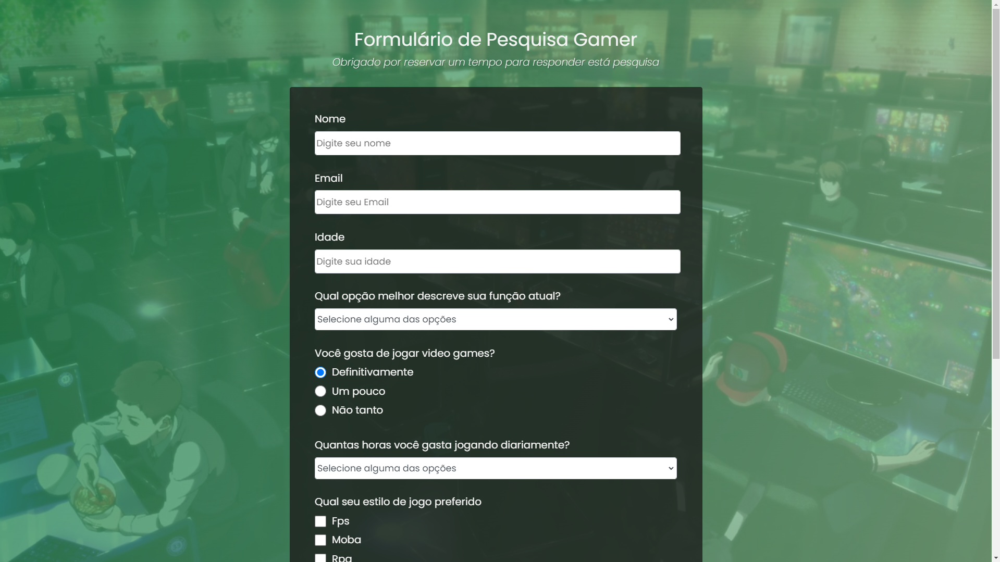

<h1 align="center">formulário Gamer</h1>

  

## 💻 Projeto

Recriação de um dos projetos do curso de Design responsivo para web da FreeCodeCamp, o projeto consiste em um formulário de 8 perguntas básicas relacionadas ao mundo dos games,
sendo elas:

- Qual é o seu nome?
- Qual é o seu email
- Qual é a sua idade?
- Qual é a sua função atual?
- Você gosta de jogar video games?
- Quantas horas você joga por dia?
- Qual seu estilo de jogo favorito?
- Qual o seu jogo favorito?

Este projeto foi feito com o intuito de estudar o HTML e CSS puros! 

## :rocket: Tecnologias

- [HTML](https://developer.mozilla.org/pt-BR/docs/Web/HTML)
- [CSS](https://developer.mozilla.org/pt-BR/docs/Web/CSS)
